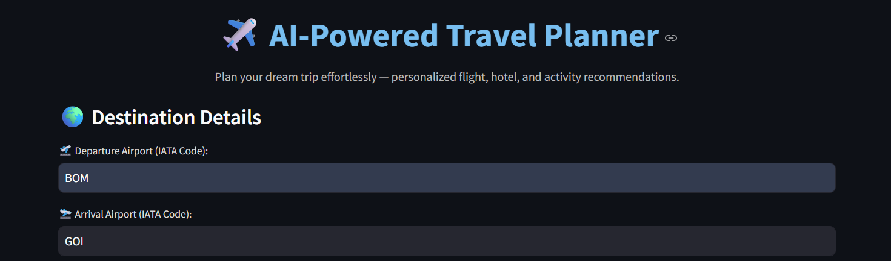
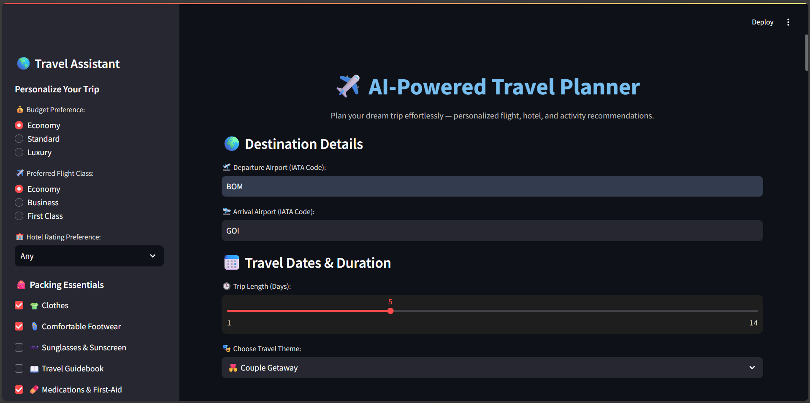
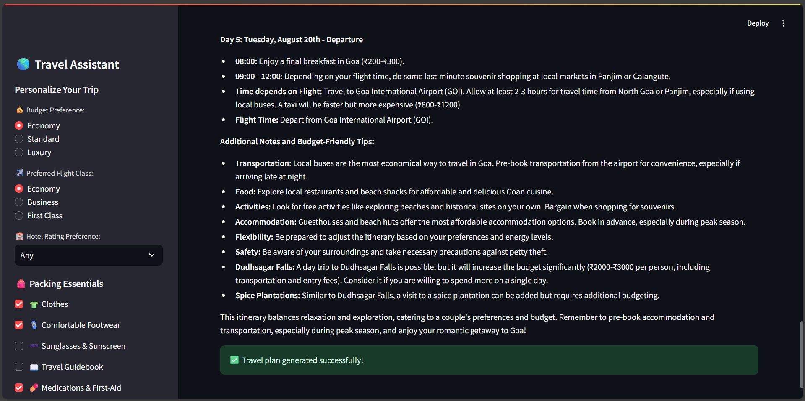
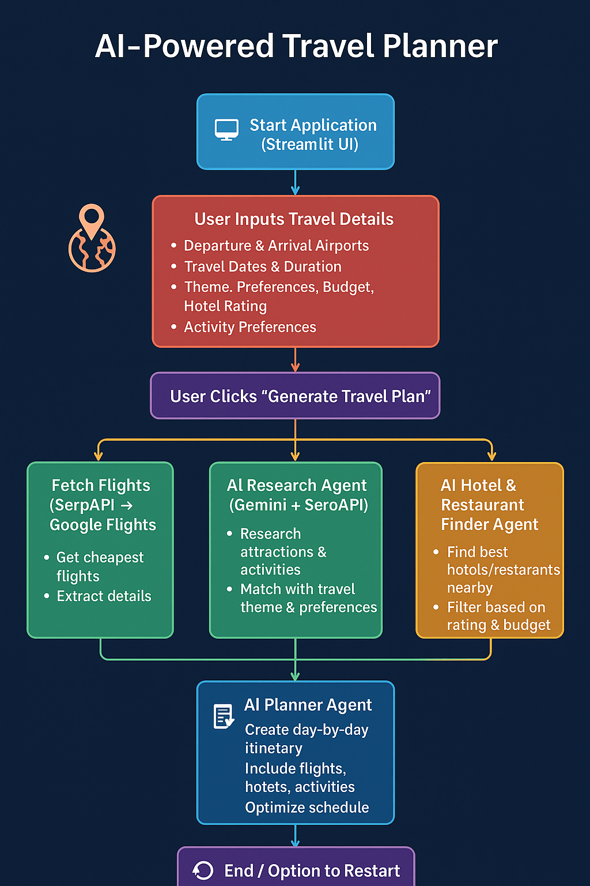

<!-- Project Header -->
<p align="center">
  
</p>
<h1 align="center">✈️ AI-Powered Travel Planner</h1>
<p align="center">
  <b>Plan your dream trip with AI – Find flights, hotels, and activities tailored to your style!</b>
</p>

<p align="center">
  
  
  
  
</p>

---

## 📸 Project Preview

<p align="center">
  
  
  
</p>

---

## 🌟 Features

✅ **Live Flight Search** – Uses SerpAPI to fetch real-time cheapest flights.  
✅ **AI Destination Research** – Gemini AI suggests attractions, activities, and travel tips.  
✅ **Hotel & Restaurant Finder** – Finds top-rated hotels and restaurants near attractions.  
✅ **Personalized Itinerary** – AI creates a day-by-day schedule based on preferences.  
✅ **Dark Mode UI** – Sleek and travel-friendly theme.  
✅ **Packing Checklist** – Prepares you for the trip with essentials.  

---

## 🛠️ Tech Stack

| Technology       | Usage |
|------------------|-------|
| **Python**       | Core programming language |
| **Streamlit**    | Web UI framework |
| **Google Gemini**| AI model for planning & recommendations |
| **SerpAPI**      | Flight, hotel, and activity data |
| **HTML/CSS**     | Custom styling |

---

## 🚀 How It Works

<p align="center">
  
</p>

1️⃣ **User Inputs Travel Details** – Source, destination, dates, budget, preferences.  
2️⃣ **Fetch Flights** – Using SerpAPI to Google Flights.  
3️⃣ **AI Research** – Gemini searches attractions and activities.  
4️⃣ **Hotel & Restaurant Finder** – Finds best-rated options nearby.  
5️⃣ **AI Planner** – Generates personalized day-by-day itinerary.  
6️⃣ **Results Displayed** – In beautiful card format with booking links.

---

## 📦 Installation

```bash
# Clone the repo
git clone https://github.com/yourusername/AI-Powered-Travel-Planner.git

# Navigate into the folder
cd AI-Powered-Travel-Planner

# Install dependencies
pip install -r requirements.txt
```
## ▶️ Running the App
```bash
streamlit run app.py
```
Then open http://localhost:8501 in your browser.

## ⚙️ Configuration  

You’ll need API keys:  

- **SerpAPI** → [Get API Key](https://serpapi.com/manage-api-key)  
- **Google Gemini API** → [Get API Key](https://aistudio.google.com/app/apikey)

### Create a .env file in the root folder:
```bash
SERPAPI_KEY=your_serpapi_key
GOOGLE_API_KEY=your_google_api_key
```
## 📂 Repository Structure
```bash
📦 ai-travel-planner
 ┣ 📜 app.py              # Main Streamlit app
 ┣ 📜 requirements.txt    # Python dependencies
 ┣ 📂 assets              # Images, GIFs, Flowchart
 ┗ 📜 README.md           # Documentation
```

## 🤝 Contributing

Pull requests are welcome!
If you find any bugs or have suggestions, open an issue.
## 📜 License

This project is licensed under the MIT License – feel free to use and modify it.

<p align="center">
  
</p>
